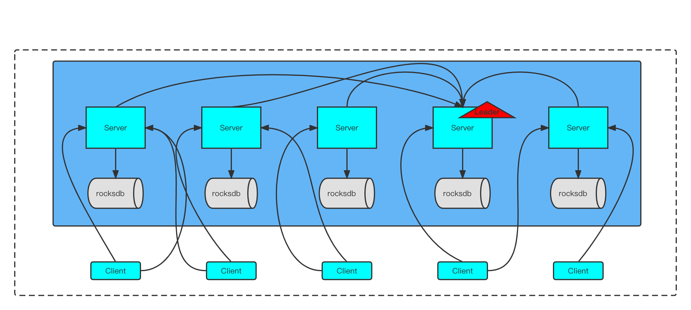

# Features
+ provide leader election base on Raft
+ store metadata into rocksdb instead of Map
+ strong consistency insurance
+ higher concurrency than zookeeper, etcd, etc...
# Design Motivation
We designed Hikarikeeper to be able to act as a coordination platform for store large scale metadata.

It would have to have high-throughput to support high concurrent read/write such as real-time sync.

It also meant the system would have to handle low-latency delivery to handle more traditional KV storage.

Finally the most import is that hikarikeeper could store lage scale metadata info

Supporting these uses led us to a design with a number of unique elements, more akin to a coordination service than a traditional kv store. We will outline some elements of the design in the following sections.
# Architecture Overview
Hikarikeeper allows distributed processes to coordinate with each other through a shared hierarchical name space of data registers much like a file system,Unlike normal file systems Hikarikeeper provides its clients with high throughput, low latency, highly available,strong consistent to the registers.
The performance aspects of Hikarikeeper allow it to be used in large distributed systems.

# Roadmap
Now it's time to dig into the full Hikarikeeper API and other guides.
+ use rocksdb to store metadata instead of ConcurrentSkipListMap
+ extract network api to support native nio, netty spi
+ a high performance distribute lock (at least more efficient than redis, come on !)
+ light-weight discovery service standalone version and spring-integration version.  
+ provide gRPC API.
+ provide thrift API.
# Performance
To be updated

# References
* [The Raft Consensus Algorithm](https://raft.github.io/)
* [logcabin-The very first implementation of Raft](https://github.com/logcabin/logcabin)
* [zookeeper](https://github.com/apache/zookeeper)
* [etcd](https://github.com/etcd-io/etcd)

